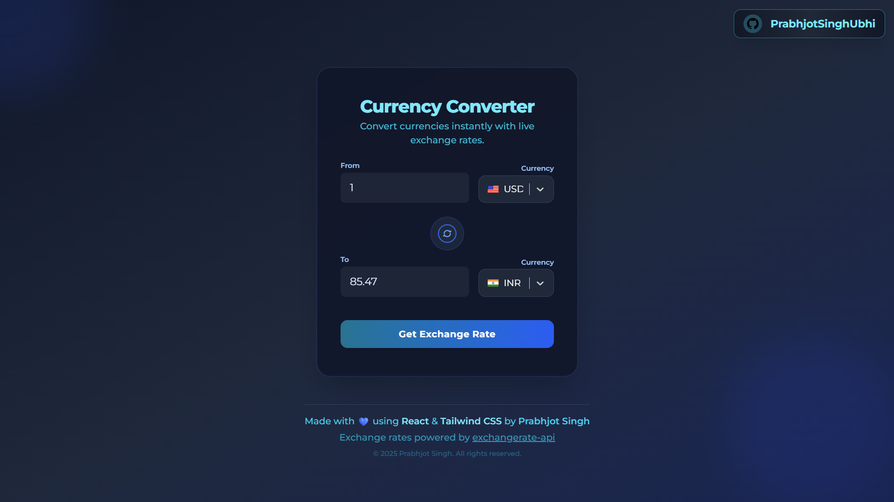

# 💱 Currency Converter

A modern, responsive currency converter built with React and Tailwind CSS. Instantly convert between 180+ currencies with real-time rates and a sleek, accessible UI.

---

<!-- Live Demo Link Placeholder -->
## 🌐 Live Demo

[View Live Demo](#) <!-- TODO: Add your deployment URL here -->

---

## 🚀 Quick Start

1. **Clone & Install**
   ```bash
   git clone https://github.com/PrabhjotSinghUbhi/React-Projects.git
   cd React-Projects/Currency-Converter
   npm install
   ```

2. **Run Locally**
   ```bash
   npm run dev
   ```
   Open [http://localhost:5173](http://localhost:5173) in your browser.

---

## ✨ Features

- **Live Exchange Rates** — Powered by ExchangeRate-API
- **180+ Currencies** — With country flags
- **Instant Conversion** — Updates as you type
- **Currency Swap** — Quick reverse conversion
- **Responsive Design** — Mobile-first, works everywhere
- **Modern UI** — Gradients, glassmorphism, smooth animations
- **Accessible** — Keyboard and screen reader friendly

---

## 🛠️ Tech Stack

- **React 19** (Hooks, functional components)
- **Vite** (Fast dev/build)
- **Tailwind CSS 4**
- **React Select** (Custom dropdowns)
- **ExchangeRate-API** (Currency data)
- **ESLint** (Linting)

---

## 📂 Project Structure

```
Currency-Converter/
├── public/
│   └── index.html
├── src/
│   ├── component/
│   │   ├── InputBox.jsx
│   │   ├── SwapIconFit.jsx
│   │   ├── GithubIcon.jsx
│   │   └── index.js
│   ├── hooks/
│   │   └── useCurrencyExchange.js
│   ├── App.jsx
│   ├── main.jsx
│   └── options.js
├── package.json
├── vite.config.js
└── README.md
```

---

## 📸 Screenshots



---

## 📝 Usage

1. Enter an amount in the "From" field.
2. Select source and target currencies.
3. View instant conversion in the "To" field.
4. Use the swap button to reverse currencies.
5. Click "Get Exchange Rate" for the latest rates.

---

## 🔗 API

- Uses [ExchangeRate-API](https://exchangerate-api.com/) (Free tier: 1,500 requests/month)

---

## 🧩 Scripts

- `npm run dev` — Start dev server
- `npm run build` — Production build
- `npm run preview` — Preview build
- `npm run lint` — Lint code

---

## 🤝 Contributing

1. Fork this repo
2. Create a branch: `git checkout -b feature/YourFeature`
3. Commit: `git commit -m "Add feature"`
4. Push: `git push origin feature/YourFeature`
5. Open a Pull Request

---

## 📄 License

MIT — see [LICENSE](LICENSE)

---

## 👤 Author

**Prabhjot Singh**  
[GitHub](https://github.com/PrabhjotSinghUbhi) | [LinkedIn](https://www.linkedin.com/in/prabhjot-singh-0a7780306)

---

## 🙏 Acknowledgments

- [ExchangeRate-API](https://exchangerate-api.com/)
- [React](https://reactjs.org/)
- [Tailwind CSS](https://tailwindcss.com/)
- [Vite](https://vitejs.dev/)

---

⭐️ Star this repo if you found it useful!